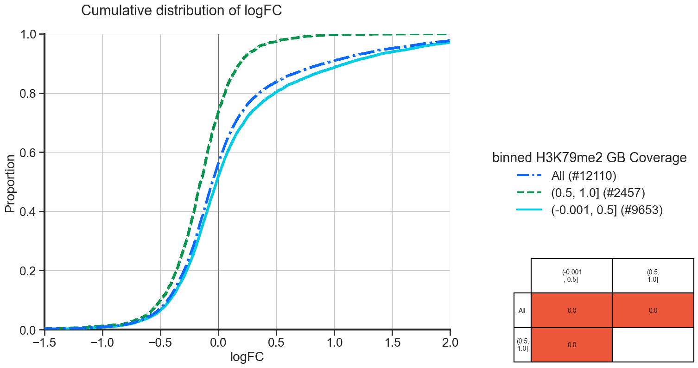
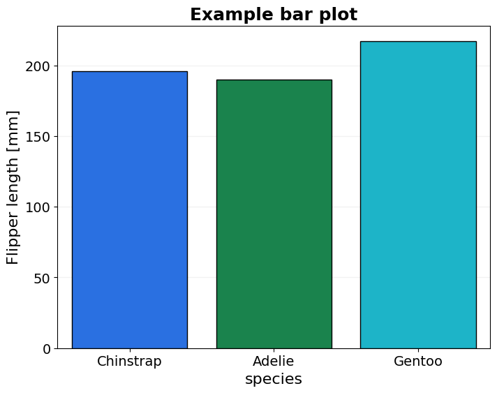

============
BasicPlotter
============

Collection of plotting functions, some quite general, others rather specific.

.. autofunction:: BasicPlotter.cumulative_plot

.. code-block:: python

    *BasicPlotter.cumulative_plot*

From the plot we can see, that the genes with more coverage of their gene body are more often downregulated and that
they have less strong positive logFC, compared to genes with lower gene body coverage.

.. autofunction:: BasicPlotter.basic_hist

.. code-block:: python

    *BasicPlotter.basic_bars*

