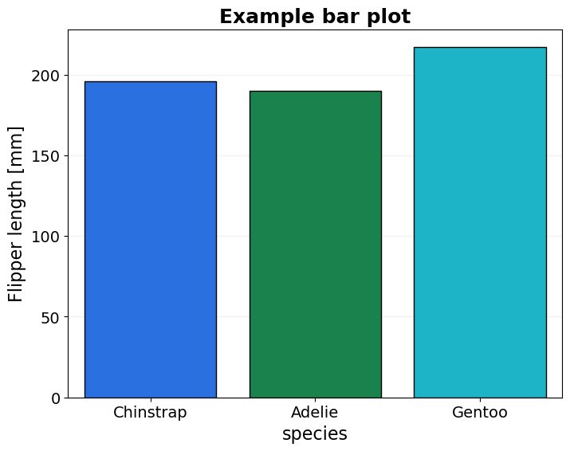
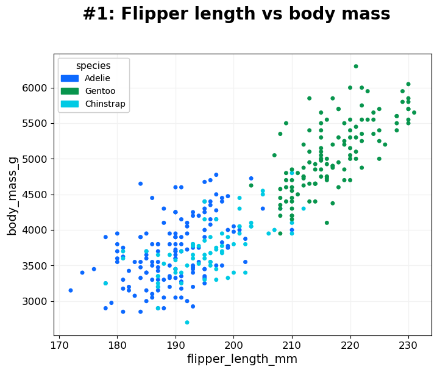

============
BasicPlotter
============

Collection of plotting functions, some quite general, others rather specific.
For many examples here we'll use the penguin dataframe provided by seaborn, because it comes conveniently with the package and because
penguins are great.

.. code-block:: python

    *BasicPlotter.base_code*

.. include:: gallery/src.BasicPlotter_base_code.txt
    :literal:

.. .--------------------------------------------------------------------------------------------------------------------
.. basic_bars
.. .--------------------------------------------------------------------------------------------------------------------
.. autofunction:: BasicPlotter.basic_bars

.. code-block:: python

    *BasicPlotter.basic_bars1*

|basic_bars| |basic_bars_hue|

.. code-block:: python

    *BasicPlotter.basic_bars2*

.. .--------------------------------------------------------------------------------------------------------------------
.. basic_stacked_bars
.. .--------------------------------------------------------------------------------------------------------------------
.. autofunction:: BasicPlotter.stacked_bars

.. code-block:: python

    *BasicPlotter.stacked_bars*

|basic_stacked_bars_absolute| |basic_stacked_bars_fraction|

.. |basic_stacked_bars_absolute| image:: gallery/species_count_StackedBars.png
   :width: 49%

.. .--------------------------------------------------------------------------------------------------------------------
.. basic_pie
.. .--------------------------------------------------------------------------------------------------------------------
.. autofunction:: BasicPlotter.basic_pie

.. code-block:: python

    *BasicPlotter.basic_pie*

.. .--------------------------------------------------------------------------------------------------------------------
.. basic_hist
.. .--------------------------------------------------------------------------------------------------------------------
.. autofunction:: BasicPlotter.basic_hist

.. code-block:: python

    *BasicPlotter.basic_hist*

.. image:: gallery/flipper_length_mm_species_Hist.png
  :width: 75%

.. .--------------------------------------------------------------------------------------------------------------------
.. basic_violin
.. .--------------------------------------------------------------------------------------------------------------------
.. autofunction:: BasicPlotter.basic_violin

.. code-block:: python

    *BasicPlotter.basic_violin*

|basic_violin| |basic_violin_boxplot|

.. |basic_violin_boxplot| image:: gallery/BoxplotJitterspecies_flipper_length_mm_None_Violin.png
   :width: 49%

.. .--------------------------------------------------------------------------------------------------------------------
.. basic_2Dhist
.. .--------------------------------------------------------------------------------------------------------------------
.. autofunction:: BasicPlotter.basic_2Dhist

.. code-block:: python

    *BasicPlotter.basic_2Dhist*

.. image:: gallery/flipper_length_mm_body_mass_g_None_2DHist.png
  :width: 60%

.. .--------------------------------------------------------------------------------------------------------------------
.. basic_lineplot
.. .--------------------------------------------------------------------------------------------------------------------
.. autofunction:: BasicPlotter.basic_lineplot

.. code-block:: python

    *BasicPlotter.basic_lineplot*

.. .--------------------------------------------------------------------------------------------------------------------
.. multi_mod_plot
.. .--------------------------------------------------------------------------------------------------------------------
.. autofunction:: BasicPlotter.multi_mod_plot

.. code-block:: python

    *BasicPlotter.multi_mod_plot*

|multi_mod_plot_1| |multi_mod_plot_2|

|multi_mod_plot_3| |multi_mod_plot_4|

.. |multi_mod_plot_3| image:: gallery/flipper_length_mmVsbody_mass_g_bill_length_mm_markerisland.png
   :width: 49%

.. .--------------------------------------------------------------------------------------------------------------------
.. basic_venn
.. .--------------------------------------------------------------------------------------------------------------------
.. autofunction:: BasicPlotter.basic_venn

.. code-block:: python

    *BasicPlotter.basic_venn*

.. .--------------------------------------------------------------------------------------------------------------------
.. overlap_heatmap
.. .--------------------------------------------------------------------------------------------------------------------
.. autofunction:: BasicPlotter.overlap_heatmap

.. code-block:: python

    *BasicPlotter.overlap_heatmap*

|fraction_map| |jaccard_map|

.. |fraction_map| image:: gallery/Ingredients_Fraction_SharedHeatmap.png
   :width: 49%

.. |jaccard_map| image:: gallery/Ingredients_Jaccard_SharedHeatmap.png
   :width: 49%

.. .--------------------------------------------------------------------------------------------------------------------
.. upset_plotter
.. .--------------------------------------------------------------------------------------------------------------------
.. autofunction:: BasicPlotter.upset_plotter

.. code-block:: python

    *BasicPlotter.upset_plotter*

.. image:: gallery/Ingredients_UpSet.png
   :width: 80%

.. .--------------------------------------------------------------------------------------------------------------------
.. cumulative_plot
.. .--------------------------------------------------------------------------------------------------------------------
.. autofunction:: BasicPlotter.cumulative_plot

.. code-block:: python

    *BasicPlotter.cumulative_plot*

From the plot we can see, that the genes with more coverage of their gene body are more often downregulated and that
they have less strong positive logFC, compared to genes with lower gene body coverage.

.. image:: gallery/logFC_binned_H3K79me2_GB_Coverage.png
  :width: 90%