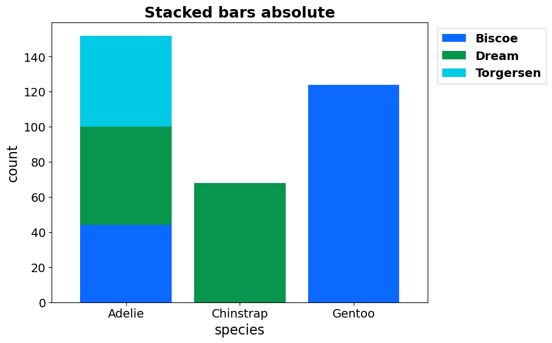
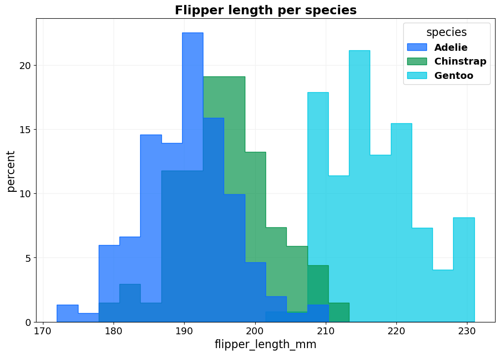
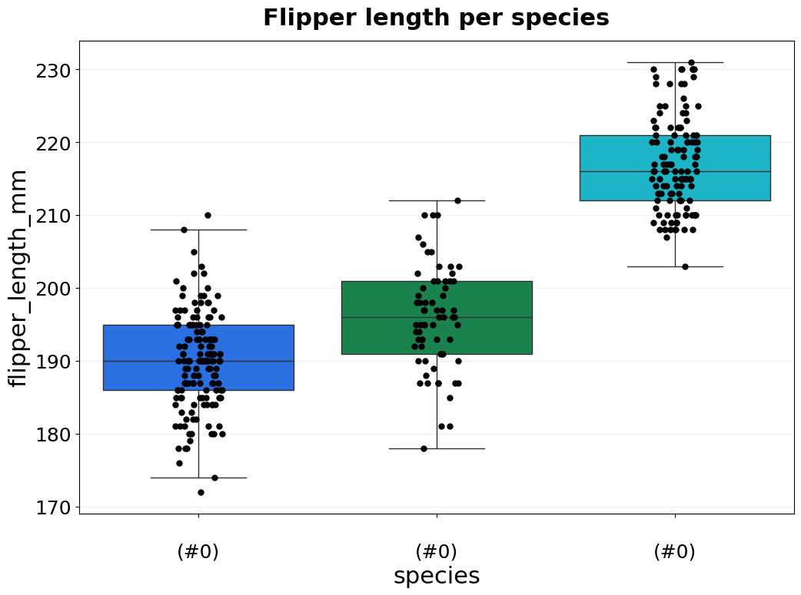
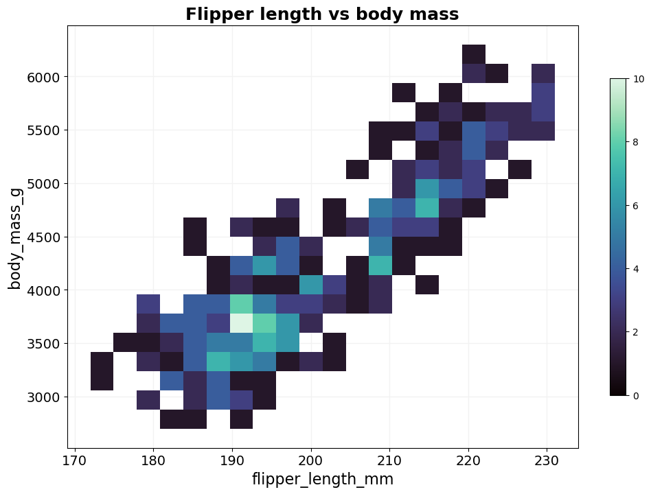
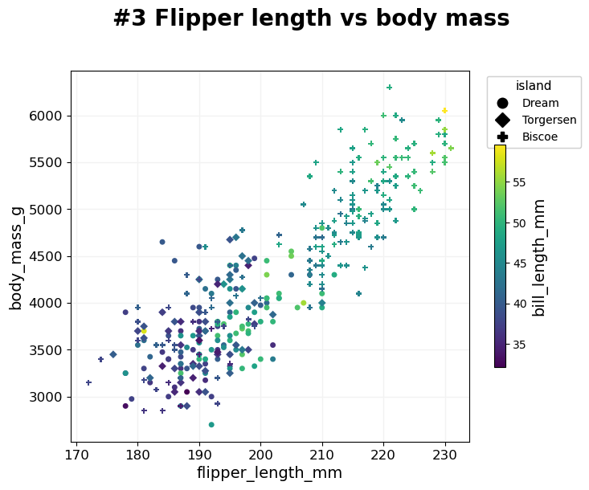
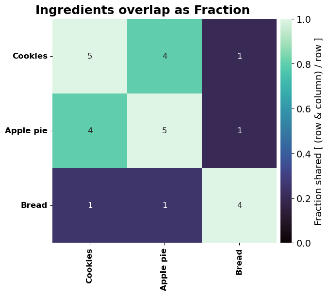

============
BasicPlotter
============

Collection of plotting functions, some quite general, others rather specific.
For many examples here we'll use the penguin dataframe provided by seaborn, because it comes conveniently with the package and because
penguins are great.

.. code-block:: python

    # Block that has to be executed for all.
    import BasicPlotter
    import pandas as pd
    import seaborn as sns
    out_dir = 'docs/gallery/'
    penguin_df = sns.load_dataset('penguins')   # Example data from seaborn.
    print(penguin_df.head())
    

.. include:: gallery/src.BasicPlotter_base_code.txt
    :literal:

.. .--------------------------------------------------------------------------------------------------------------------
.. basic_bars
.. .--------------------------------------------------------------------------------------------------------------------
.. autofunction:: BasicPlotter.basic_bars

.. code-block:: python

    # Make a basic barplot with the average flipper length per species.
    avg_flipper_length = pd.DataFrame(penguin_df.groupby('species')['flipper_length_mm'].mean())
    BasicPlotter.basic_bars(avg_flipper_length, x_col='species', y_col='flipper_length_mm', formats=['png'],
                            x_order=['Chinstrap', 'Adelie', 'Gentoo'], title='Example bar plot',
                            output_path=out_dir, y_label='Flipper length [mm]', rotation=None, palette='glasbey_cool')
    
    # Make a second version where we additionally split by sex per species.
    avg_flipper_length_sex = pd.DataFrame(penguin_df.groupby(['species', 'sex'])['flipper_length_mm'].mean()).reset_index()
    BasicPlotter.basic_bars(avg_flipper_length_sex, x_col='species', y_col='flipper_length_mm', formats=['png'],
                            hue_col='sex', x_order=['Chinstrap', 'Adelie', 'Gentoo'], title='Example bar plot with hue',
                            output_path=out_dir + "SexHue", y_label='Flipper length [mm]', rotation=None,
                            palette='glasbey_cool')
    

|basic_bars| |basic_bars_hue|

.. |basic_bars| image:: gallery/species_flipper_length_mm_Bars.png
   :width: 45%

.. |basic_bars_hue| image:: gallery/SexHuespecies_flipper_length_mm_Bars.png
   :width: 45%

.. .--------------------------------------------------------------------------------------------------------------------
.. basic_stacked_bars
.. .--------------------------------------------------------------------------------------------------------------------
.. autofunction:: BasicPlotter.stacked_bars

.. code-block:: python

    # For multiple groups per bar, let's look at from which island the penguins came. Plot it once as absolute numbers
    # and again as fraction.
    species_island = penguin_df.groupby(['species', 'island']).size().reset_index().rename(columns={0: 'count'}).pivot(index='species', columns='island', values='count')
    for do_fraction in [True, False]:
        BasicPlotter.stacked_bars(species_island, x_col='species', y_cols=species_island.columns, y_label='count', sort_stacks=False,
                                  title='Stacked bars '+('fraction' if do_fraction else 'absolute'), output_path=out_dir, legend_out=1.33,
                                  rotation=0, palette='glasbey_cool', fraction=do_fraction, formats=['png'])
    

|basic_stacked_bars_absolute| |basic_stacked_bars_fraction|

.. |basic_stacked_bars_fraction| image:: gallery/species_Fractionofcount_FracStackedBars.png
   :width: 49%

.. .--------------------------------------------------------------------------------------------------------------------
.. basic_pie
.. .--------------------------------------------------------------------------------------------------------------------
.. autofunction:: BasicPlotter.basic_pie

.. code-block:: python

    # An alternative to stacked barplots when focusing on one group are pie charts.
    species_island_adelie = pd.DataFrame(penguin_df.groupby(['species', 'island']).size().reset_index().rename(columns={0: 'count'}).pivot(index='species', columns='island', values='count').loc['Adelie'])
    BasicPlotter.basic_pie(species_island_adelie, title='Adelie islands', palette='glasbey_cool', numerate=True,
                           output_path=out_dir, legend_title='island', formats=['png'])
    

.. image:: gallery/Adelie_PieChart.png
  :width: 40%

.. .--------------------------------------------------------------------------------------------------------------------
.. basic_hist
.. .--------------------------------------------------------------------------------------------------------------------
.. autofunction:: BasicPlotter.basic_hist

.. code-block:: python

    # Look at the whole distribution of flipper length by using a histogram and split by species.
    BasicPlotter.basic_hist(penguin_df, x_col='flipper_length_mm', hue_col='species', bin_num=20, title='Flipper length per species',
                            output_path=out_dir, stat='percent', palette='glasbey_cool', element='step', alpha=0.7, formats=['png'])
    

.. .--------------------------------------------------------------------------------------------------------------------
.. basic_violin
.. .--------------------------------------------------------------------------------------------------------------------
.. autofunction:: BasicPlotter.basic_violin

.. code-block:: python

    # An alternative is to separate the species along the x-axis and do violin plots.
    BasicPlotter.basic_violin(penguin_df, y_col='flipper_length_mm', x_col='species', title='Flipper length per species',
                              output_path=out_dir, numerate=True, palette='glasbey_cool', formats=['png'])
    # Alternatively do boxplots instead and also add the individual data points as jitter.
    BasicPlotter.basic_violin(penguin_df, y_col='flipper_length_mm', x_col='species', title='Flipper length per species',
                              output_path=out_dir+"BoxplotJitter", numerate=True, palette='glasbey_cool', formats=['png'],
                              boxplot=True, jitter=True)
    

|basic_violin| |basic_violin_boxplot|

.. |basic_violin| image:: gallery/species_flipper_length_mm_None_Violin.png
   :width: 49%

.. .--------------------------------------------------------------------------------------------------------------------
.. basic_2Dhist
.. .--------------------------------------------------------------------------------------------------------------------
.. autofunction:: BasicPlotter.basic_2Dhist

.. code-block:: python

    # Plot the distribution of two features as 2D histogram. This example has very few points, so a scatter would work better.
    BasicPlotter.basic_2Dhist(penguin_df, columns=['flipper_length_mm', 'body_mass_g'], bin_num=20, title='Flipper length vs body mass',
                              output_path=out_dir, cbar=True, formats=['png'])
    

.. .--------------------------------------------------------------------------------------------------------------------
.. multi_mod_plot
.. .--------------------------------------------------------------------------------------------------------------------
.. autofunction:: BasicPlotter.multi_mod_plot

.. code-block:: python

    # This one is a scatterplot with a lot of additional options.
    # Start with a scatterplot where we colour the dots by the species, each dot being one penguin.
    BasicPlotter.multi_mod_plot(penguin_df, score_cols=['flipper_length_mm', 'body_mass_g'], colour_col='species',
                                output_path=out_dir, title='#1: Flipper length vs body mass', alpha=1, palette='glasbey_cool',
                                msize=25, formats=['png'])
    # Next, let's add markers to show the island where the penguin was measured.
    BasicPlotter.multi_mod_plot(penguin_df, score_cols=['flipper_length_mm', 'body_mass_g'], colour_col='species',
                                marker_col='island', output_path=out_dir, title='#2 Flipper length vs body mass',
                                alpha=1, palette='glasbey_cool', msize=25, formats=['png'])
    # Alternatively to having the colours categorical, we can also add a third continuous feature as colour.
    BasicPlotter.multi_mod_plot(penguin_df, score_cols=['flipper_length_mm', 'body_mass_g'], colour_col='bill_length_mm',
                                marker_col='island', output_path=out_dir, title='#3 Flipper length vs body mass',
                                alpha=1, msize=25, formats=['png'])
    # In addition, label the five heaviest for which we need an additional boolean column saying
    # whether a dot should be labelled. The text for the label could be anything, here we write the body mass itself.
    top5_index = penguin_df.sort_values('body_mass_g', ascending=False).index[:5]
    penguin_df['add_label'] = [i in top5_index for i in penguin_df.index]
    BasicPlotter.multi_mod_plot(penguin_df, score_cols=['flipper_length_mm', 'body_mass_g'], colour_col='bill_length_mm',
                                marker_col='island', label_dots=['add_label', 'body_mass_g'], output_path=out_dir+"doLabel",
                                title='#4 Flipper length vs body mass',
                                alpha=1, msize=25, formats=['png'])
    

|multi_mod_plot_1| |multi_mod_plot_2|

.. |multi_mod_plot_1| image:: gallery/flipper_length_mmVsbody_mass_g_species_markerNone.png
   :width: 42%

.. |multi_mod_plot_2| image:: gallery/flipper_length_mmVsbody_mass_g_species_markerisland.png
   :width: 52%

|multi_mod_plot_3| |multi_mod_plot_4|

.. |multi_mod_plot_4| image:: gallery/doLabelflipper_length_mmVsbody_mass_g_bill_length_mm_markerisland.png
   :width: 49%

.. .--------------------------------------------------------------------------------------------------------------------
.. basic_venn
.. .--------------------------------------------------------------------------------------------------------------------
.. autofunction:: BasicPlotter.basic_venn

.. code-block:: python

    # Plot the overlap of lists of ingredients (incomplete) as a Venn diagram.
    ingredients = {"Cookies": {'butter', 'sugar', 'flour', 'baking powder', 'chocolate'},
                   'Apple pie': {'butter', 'sugar', 'flour', 'baking powder', 'apples'},
                   'Bread': {'flour', 'yeast', 'oil', 'salt'}}
    BasicPlotter.basic_venn(input_sets=ingredients, plot_path=out_dir+"Ingredients", formats=['png'])
    

.. image:: gallery/Ingredients_Venn.png
  :width: 40%

.. .--------------------------------------------------------------------------------------------------------------------
.. overlap_heatmap
.. .--------------------------------------------------------------------------------------------------------------------
.. autofunction:: BasicPlotter.overlap_heatmap

.. code-block:: python

    # Do the overlap again but now once with the Jaccard index and once as fraction.
    ingredients = {"Cookies": {'butter', 'sugar', 'flour', 'baking powder', 'chocolate'},
                   'Apple pie': {'butter', 'sugar', 'flour', 'baking powder', 'apples'},
                   'Bread': {'flour', 'yeast', 'oil', 'salt'}}
    for mode in ['Fraction', 'Jaccard']:
        BasicPlotter.overlap_heatmap(inter_sets=ingredients, title="Ingredients overlap as "+mode, plot_path=out_dir+"Ingredients_"+mode,
                                     xsize=10, ysize=6, mode=mode, annot_type='Jaccard' if mode == 'Jaccard' else 'Absolute', formats='png')
    

|fraction_map| |jaccard_map|

.. |jaccard_map| image:: gallery/Ingredients_Jaccard_SharedHeatmap.png
   :width: 49%

.. .--------------------------------------------------------------------------------------------------------------------
.. upset_plotter
.. .--------------------------------------------------------------------------------------------------------------------
.. autofunction:: BasicPlotter.upset_plotter

.. code-block:: python

    # Use the same sets from the previous function, but now visualize the overlap with an UpsetPlot.
    ingredients = {"Cookies": {'butter', 'sugar', 'flour', 'baking powder', 'chocolate'},
                   'Apple pie': {'butter', 'sugar', 'flour', 'baking powder', 'apples'},
                   'Bread': {'flour', 'yeast', 'oil', 'salt'}}
    BasicPlotter.upset_plotter(inter_sets=ingredients, sort_categories_by='input', title_tag='Ingredients overlap',
                               plot_path=out_dir+"Ingredients", intersection_plot_elements=4, formats=['png'])
    

.. image:: gallery/Ingredients_UpSet.png
   :width: 80%

.. .--------------------------------------------------------------------------------------------------------------------
.. cumulative_plot
.. .--------------------------------------------------------------------------------------------------------------------
.. autofunction:: BasicPlotter.cumulative_plot

.. code-block:: python

    # This is most instructive with diverging data e.g. logFC from RNA-seq. We use the RNA data from a study on the histone
    # mark H379me2 (10.1038/s41467-022-35070-2) and a formatted file from their supplements.
    rna_file = 'ExampleData/41467_2022_35070_MOESM4_ESM_E16Sub.txt'
    rna_table = pd.read_table(rna_file, sep='\t', header=0)
    # Add a column that groups genes into rough bins of how much of the gene body is covered.
    rna_table['binned H3K79me2 GB Coverage'] = pd.cut(rna_table['H3K79me2 GB Coverage'], bins=2).astype('string')
    BasicPlotter.cumulative_plot(rna_table, x_col='logFC', hue_col='binned H3K79me2 GB Coverage', palette='glasbey_cool', xlimit=[-1.5, 2],
                                 add_all=True, output_path=out_dir, numerate=True, title=None, vertical_line=0, table_width=0.4, table_x_pos=1.2, formats=['png'])
    

From the plot we can see, that the genes with more coverage of their gene body are more often downregulated and that
they have less strong positive logFC, compared to genes with lower gene body coverage.

.. image:: gallery/logFC_binned_H3K79me2_GB_Coverage.png
  :width: 90%