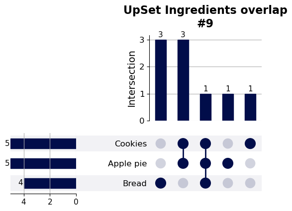

============
BasicPlotter
============

Collection of plotting functions, some quite general, others rather specific.
For many examples here we'll use the penguin dataframe provided by seaborn, because it comes conveniently with the package and because
penguins are great.

.. code-block:: python

    # Block that has to be executed for all.
    import BasicPlotter
    import pandas as pd
    import seaborn as sns
    out_dir = 'docs/gallery/'
    penguin_df = sns.load_dataset('penguins')   # Example data from seaborn.
    

.. .--------------------------------------------------------------------------------------------------------------------
.. basic_hist
.. .--------------------------------------------------------------------------------------------------------------------
.. autofunction:: BasicPlotter.basic_hist

.. code-block:: python

    avg_flipper_length = pd.DataFrame(penguin_df.groupby('species')['flipper_length_mm'].mean())
    BasicPlotter.basic_bars(penguin_df, x_col='species', y_col='flipper_length_mm', formats=['png'],
                            x_order=['Chinstrap', 'Adelie', 'Gentoo'], title='Group of pinguins on land is called a waddle',
                            output_path=out_dir, y_label='Flipper length [mm]', rotation=None, palette='glasbey_cool')
    

.. image:: gallery/species_flipper_length_mm_Bars.png
  :alt: basic_bars

.. .--------------------------------------------------------------------------------------------------------------------
.. overlap_heatmap
.. .--------------------------------------------------------------------------------------------------------------------
.. autofunction:: BasicPlotter.overlap_heatmap

.. code-block:: python

    # Plot the overlap of lists of ingredients (incomplete), once with the Jaccard index and once as fraction.
    ingredients = {"Cookies": {'butter', 'sugar', 'flour', 'baking powder', 'chocolate'},
                   'Apple pie': {'butter', 'sugar', 'flour', 'baking powder', 'apples'},
                   'Bread': {'flour', 'yeast', 'oil', 'salt'}}
    for mode in ['Fraction', 'Jaccard']:
        BasicPlotter.overlap_heatmap(inter_sets=ingredients, title="Ingredients overlap as "+mode, plot_path=out_dir+"Ingredients_"+mode,
                                     xsize=10, ysize=6, mode=mode, annot_type='Jaccard' if mode == 'Jaccard' else 'Absolute', formats='png')
    

|fraction_map| |jaccard_map|

.. |fraction_map| image:: gallery/Ingredients_Fraction_SharedHeatmap.png
   :width: 49%

.. |jaccard_map| image:: gallery/Ingredients_Jaccard_SharedHeatmap.png
   :width: 49%

.. .--------------------------------------------------------------------------------------------------------------------
.. upset_plotter
.. .--------------------------------------------------------------------------------------------------------------------
.. autofunction:: BasicPlotter.upset_plotter

.. code-block:: python

    # Use the same sets from the previous function, but now visualize the overlap with an UpsetPlot.
    ingredients = {"Cookies": {'butter', 'sugar', 'flour', 'baking powder', 'chocolate'},
                   'Apple pie': {'butter', 'sugar', 'flour', 'baking powder', 'apples'},
                   'Bread': {'flour', 'yeast', 'oil', 'salt'}}
    BasicPlotter.upset_plotter(inter_sets=ingredients, sort_categories_by='input', title_tag='Ingredients overlap',
                               plot_path=out_dir+"Ingredients", intersection_plot_elements=4, formats=['png'])
    

.. .--------------------------------------------------------------------------------------------------------------------
.. cumulative_plot
.. .--------------------------------------------------------------------------------------------------------------------
.. autofunction:: BasicPlotter.cumulative_plot

.. code-block:: python

    # This is most instructive with diverging data e.g. logFC from RNA-seq. We use the RNA data from a study on the histone
    # mark H379me2 (10.1038/s41467-022-35070-2) and a formatted file from their supplements.
    rna_file = 'ExampleData/41467_2022_35070_MOESM4_ESM_E16Sub.txt'
    rna_table = pd.read_table(rna_file, sep='\t', header=0)
    # Add a column that groups genes into rough bins of how much of the gene body is covered.
    rna_table['binned H3K79me2 GB Coverage'] = pd.cut(rna_table['H3K79me2 GB Coverage'], bins=2).astype('string')
    BasicPlotter.cumulative_plot(rna_table, x_col='logFC', hue_col='binned H3K79me2 GB Coverage', palette='glasbey_cool', xlimit=[-1.5, 2],
                                 add_all=True, output_path=out_dir, numerate=True, title=None, vertical_line=0, table_width=0.4, table_x_pos=1.2, formats=['png'])
    

From the plot we can see, that the genes with more coverage of their gene body are more often downregulated and that
they have less strong positive logFC, compared to genes with lower gene body coverage.

.. image:: gallery/logFC_binned_H3K79me2_GB_Coverage.png
  :width: 90%