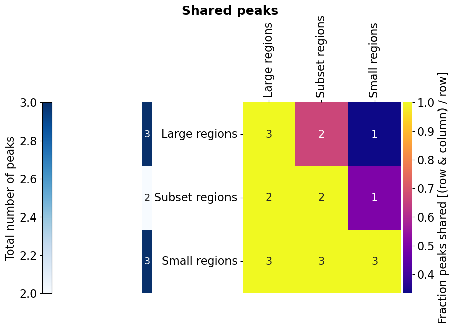

============
Bed Analysis
============

Analyses related to bed-files, where the peaks are located with respect to genes, how multiple bed-files overlap, or to
get a mapping of overlapping peaks between files and genes and more.
Centred on the usage of `pybedtools <https://daler.github.io/pybedtools/>`_, but also works with stored bed-files.
To run the example code for this module, we will always start with this block of code:

.. code-block:: python

    *Bed_Analysis.base_code*

.. autofunction:: Bed_Analysis.gene_location_bpwise

.. code-block:: python

    *Bed_Analysis.gene_location_bpwise*

|pic1| |pic2|

.. |pic1| image:: gallery/Example_peaks_GeneFeatureLocation_bpwiseOverlap_PieChart.png
   :width: 45%

.. |pic2| image:: gallery/InclExternalExample_peaks_GeneFeatureLocation_bpwiseOverlap_PieChart.png
   :width: 45%

.. autofunction:: Bed_Analysis.intersection_heatmap

.. code-block:: python

    *Bed_Analysis.intersection_heatmap*

.. code-block:: python

    *Bed_Analysis.intersection_heatmap_fisher*

Don't expect a very meaningful result here. The data is limited to chr1 and the activity filter of the peaks per cell type rather crude.

|pic3| |pic4|

.. |pic4| image:: gallery/HockerATAC_MultiIntersectHeat_Fisher.png
   :width: 45%

.. autofunction:: Bed_Analysis.upset_to_reference

.. code-block:: python

    *Bed_Analysis.upset_to_reference*

.. image:: gallery/_UpSet_Subset_peaks.png
   :width: 80%

.. autofunction:: Bed_Analysis.peaks_peaks_overlap

.. code-block:: python

    *Bed_Analysis.peaks_peaks_overlap*

.. include:: gallery/src.Bed_Analysis.peaks_peaks_overlap.txt
    :literal:

.. autofunction:: Bed_Analysis.peaks_promoter_overlap

.. code-block:: python

    *Bed_Analysis.peaks_promoter_overlap*

.. include:: gallery/src.Bed_Analysis.peaks_promoter_overlap.txt
    :literal:

.. autofunction:: Bed_Analysis.peaks_fetch_col

.. code-block:: python

    *Bed_Analysis.peaks_fetch_col1*

Take a look at the example ATAC peaks and the files defined by the file system pattern.
BaseATAC_peaks.txt

.. include:: ../ExampleData/BaseATAC_peaks.txt
    :literal:

DiffATAC/DiffATAC_Macs.txt

.. include:: ../ExampleData/DiffATAC/DiffATAC_Macs.txt
    :literal:

DiffATAC/DiffATAC_TCells.txt

.. include:: ../ExampleData/DiffATAC/DiffATAC_TCells.txt
    :literal:

.. code-block:: python

    *Bed_Analysis.peaks_fetch_col2*

.. include:: gallery/src.Bed_Analysis.peaks_fetch_col.txt
    :literal:

.. autofunction:: Bed_Analysis.peaks_genebody_overlap

.. code-block:: python

    *Bed_Analysis.peaks_genebody_overlap*

.. include:: gallery/src.Bed_Analysis.peaks_genebody_overlap.txt
    :literal:

.. autofunction:: Bed_Analysis.possible_interactions

.. code-block:: python

    *Bed_Analysis.possible_interactions*

.. include:: gallery/src.Bed_Analysis.possible_interactions.txt
    :literal:
