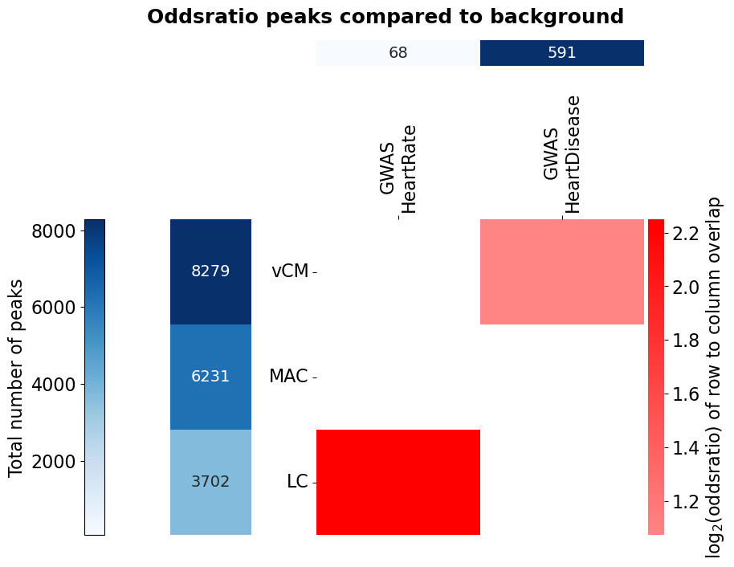

============
Bed Analysis
============

Analyses related to bed-files, where the peaks are located with respect to genes, how multiple bed-files overlap, or to
get a mapping of overlapping peaks between files and genes and more.
Centred on the usage of `pybedtools <https://daler.github.io/pybedtools/>`_, but also works with stored bed-files.
To run the example code for this module, we will always start with this block of code:

.. code-block:: python

    import Bed_Analysis
    from pybedtools import BedTool
    out_dir = 'docs/gallery/'  # Replace with wherever you want to store it.
    

.. autofunction:: Bed_Analysis.gene_location_bpwise

.. code-block:: python

    example_bed_file = "ExampleData/H3K27acPeaks_chr21.narrowPeak"
    bed_dict = {'Example peaks': example_bed_file}  # Can have multiple entries, producing output for each.
    annotation = 'ExampleData/gencode.v38.annotation_chr21Genes.gtf'
    # Use a small set of peaks as example.
    region_locs, total_locs = Bed_Analysis.gene_location_bpwise(bed_dict=bed_dict, gtf_file=annotation,
                                                                plot_path=out_dir, tss_type='5', palette='glasbey_cool', formats=['png'])
    # We can add overlap with an additional bed-file as pie piece. In this example we use a few peaks from the original
    # bed-file itself.
    external_bed = 'ExampleData/H3K27acPeaks_chr21_subset.narrowPeak.txt'
    region_locs, total_locs = Bed_Analysis.gene_location_bpwise(bed_dict=bed_dict, gtf_file=annotation, external_bed={"External bed": external_bed},
                                                                plot_path=out_dir+"InclExternal", tss_type='5', palette='glasbey_cool', formats=['png'])
    

|pic1| |pic2|

.. |pic1| image:: gallery/Example_peaks_GeneFeatureLocation_bpwiseOverlap_PieChart.png
   :width: 45%

.. |pic2| image:: gallery/InclExternalExample_peaks_GeneFeatureLocation_bpwiseOverlap_PieChart.png
   :width: 45%

.. autofunction:: Bed_Analysis.intersection_heatmap

.. image:: gallery/IGV_MultiBed.png
   :width: 90%

.. code-block:: python

    # For the example, let's create three BedTool object that match the image above. The first one with three large regions,
    # the second repeating two of those regions, and the last having multiple small regions inside one of those.
    large_regions = BedTool('\n'.join(['chr1\t1\t1000', 'chr1\t2000\t3000', 'chr1\t4000\t5000']), from_string=True)
    subset_regions = BedTool('\n'.join(['chr1\t1\t1000', 'chr1\t2000\t3000']), from_string=True)
    small_regions = BedTool('\n'.join(['chr1\t100\t300', 'chr1\t400\t600', 'chr1\t700\t900']), from_string=True)
    multi_bed_dict = {'Large regions': large_regions,
                      'Subset regions': subset_regions,
                      'Small regions': small_regions}
    Bed_Analysis.intersection_heatmap(multi_bed_dict, region_label='peaks', plot_path=out_dir, annot_nums=True,  x_size=10, y_size=7,
                               wspace=1.3, hspace=0.7, width_ratios=[0.05, 0.05, 0.96], height_ratios=[0.05, 0.97], formats=['png'])
    

.. image:: gallery/_MultiIntersectHeat.png
   :width: 90%

.. code-block:: python

    # Now we repeat the analysis above, but instead of just doing the pairwise-intersection, we make use of the fisher mode
    # of the function. For that, we need data with more entries (limited to chr1 though). We use the scATAC-seq data from Hocker 2021 (10.1126/sciadv.abf1444)
    # which was aggregated on cell type-level. They defined a union set of ATAC peaks and calculated the RPKM per cell type cluster.
    # For four cell types (vCM: ventricular cardiomyocytes, MAC: macrophages, LC: lymphocytes) we subset this union to those peaks with RPKM ≥ 2 in
    # the respective cell type. These peaks we then intersect with GWAS SNPs from the GWAS catalog for the traits heart rate
    # (EFO_0004326) and immune system disease (EFO_0000540). Since we need a group for comparison for the Fisher's exact test,
    # we take all chr1 ATAC peaks as background (the function will remove the foreground peaks from the background).
    fisher_bed_dict = {"vCM": 'ExampleData/MultiBedFisher/Hocker2021_ATAC_vCM_chr1.bed',
                       "MAC": 'ExampleData/MultiBedFisher/Hocker2021_ATAC_MAC_chr1.bed',
                       "LC": 'ExampleData/MultiBedFisher/Hocker2021_ATAC_LC_chr1.bed',
                       'GWAS\nHeartRate': 'ExampleData/MultiBedFisher/GWAS_EFO_0004326_heart-rate.txt',
                       'GWAS\nHeartDisease': 'ExampleData/MultiBedFisher/GWAS_EFO_0003777_heart-disease.txt'}
    fisher_background = {c: 'ExampleData/MultiBedFisher/Hocker2021_ATAC_Union_chr1.bed' for c in ['vCM', 'MAC', 'LC']}
    Bed_Analysis.intersection_heatmap(fisher_bed_dict, region_label='peaks', fisher=True, fisher_background=fisher_background,
                                      row_beds=['vCM', 'MAC', 'LC'], col_beds=['GWAS\nHeartRate', 'GWAS\nHeartDisease'],
                                      plot_path=out_dir+"HockerATAC", annot_nums=True,  x_size=10, y_size=8, n_cores=2,
                                      wspace=0.4, hspace=0.9, width_ratios=[0.05, 0.2, 0.96], height_ratios=[0.08, 0.97], formats=['png'])
    

Don't expect a very meaningful result here. The data is limited to chr1 and the activity filter of the peaks per cell type rather crude.

|pic3| |pic4|

.. |pic3| image:: gallery/HockerATAC_MultiIntersectHeat.png
   :width: 45%

.. autofunction:: Bed_Analysis.upset_to_reference

.. code-block:: python

    # Similar to the asymmetric above, this UpSet plot is meant for checking the overlap of bed-files with different sizes.
    # However, this one shows the overlap only with respect to one selected bed-file. Let's use the same example bed objects
    # as for the previous functions, and show the overlap only with respect to the second set of regions. One of the two
    # peaks overlaps with both the large regions and the small regions, and one only with the large regions.
    large_regions = BedTool('\n'.join(['chr1\t1\t1000', 'chr1\t2000\t3000', 'chr1\t4000\t5000']), from_string=True)
    subset_regions = BedTool('\n'.join(['chr1\t1\t1000', 'chr1\t2000\t3000']), from_string=True)
    small_regions = BedTool('\n'.join(['chr1\t100\t300', 'chr1\t400\t600', 'chr1\t700\t900']), from_string=True)
    multi_bed_dict = {'Large regions': large_regions,
                      'Subset regions': subset_regions,
                      'Small regions': small_regions}
    Bed_Analysis.upset_to_reference(bed_files=multi_bed_dict, ref_tag='Subset regions', y_label='Intersecting regions',
                                    plot_path=out_dir, formats=['png'])
    

.. image:: gallery/_UpSet_Subset_peaks.png
   :width: 80%

.. autofunction:: Bed_Analysis.peaks_peaks_overlap

.. code-block:: python

    # Let's get a mapping of two small example sets of regions where all regions from the second set are located in
    # one region of the first set.
    large_regions = BedTool('\n'.join(['chr1\t1\t1000', 'chr1\t2000\t3000', 'chr1\t4000\t5000']), from_string=True)
    small_regions = BedTool('\n'.join(['chr1\t100\t300', 'chr1\t400\t600', 'chr1\t700\t900']), from_string=True)
    peak_peak_map = Bed_Analysis.peaks_peaks_overlap(peak_file=large_regions, other_peak_file=small_regions)
    print(peak_peak_map)
    

.. include:: gallery/src.Bed_Analysis.peaks_peaks_overlap.txt
    :literal:

.. autofunction:: Bed_Analysis.peaks_promoter_overlap

.. code-block:: python

    # Now instead of intersecting multiple bed-files we get the intersection with promoter regions of genes (±200bp around the TSS).
    example_bed_file = "ExampleData/H3K27acPeaks_chr21.narrowPeak"
    annotation = 'ExampleData/gencode.v38.annotation_chr21Genes.gtf'
    peak_promoter_map, promoter_peak_map = Bed_Analysis.peaks_promoter_overlap(peak_file=example_bed_file, gtf_file=annotation, tss_type='5')
    print(list(peak_promoter_map.items())[:2])
    print(list(promoter_peak_map.items())[:2])
    

.. include:: gallery/src.Bed_Analysis.peaks_promoter_overlap.txt
    :literal:

.. autofunction:: Bed_Analysis.peaks_fetch_col

.. code-block:: python

    # Let's assume we have a set of ATAC peaks and found differential ATAC peaks for different conditions.
    base_peaks_file = 'ExampleData/BaseATAC_peaks.txt'
    # We have a directory with two bed files with a header from which we want to get the average log2FC value in all the
    # base peaks they overlap.
    diff_atac_pattern = 'ExampleData/DiffATAC/DiffATAC_*.txt'
    

Take a look at the example ATAC peaks and the files defined by the file system pattern.
BaseATAC_peaks.txt

.. include:: ../ExampleData/BaseATAC_peaks.txt
    :literal:

DiffATAC/DiffATAC_Macs.txt

.. include:: ../ExampleData/DiffATAC/DiffATAC_Macs.txt
    :literal:

DiffATAC/DiffATAC_TCells.txt

.. include:: ../ExampleData/DiffATAC/DiffATAC_TCells.txt
    :literal:

.. code-block:: python

    base_peaks_log2fc, matched_ids = Bed_Analysis.peaks_fetch_col(base_regions=base_peaks_file, pattern=diff_atac_pattern, same_peaks=False, fetch_col='log2FC')
    print(base_peaks_log2fc)
    

.. include:: gallery/src.Bed_Analysis.peaks_fetch_col.txt
    :literal:

.. autofunction:: Bed_Analysis.peaks_genebody_overlap

.. code-block:: python

    # Based on an example peak file and gtf-file, we get the fraction of the gene body that is covered by the peaks.
    peak_file = 'ExampleData/H3K27acPeaks_chr21.narrowPeak'
    annotation = 'ExampleData/gencode.v38.annotation_chr21Genes.gtf'
    gene_body_fractions = Bed_Analysis.peaks_genebody_overlap(peak_file=peak_file, gtf_file=annotation,
                                                              gene_set=['ENSG00000275895', 'ENSG00000273840'])
    print(gene_body_fractions)
    

.. include:: gallery/src.Bed_Analysis.peaks_genebody_overlap.txt
    :literal:

.. autofunction:: Bed_Analysis.possible_interactions

.. code-block:: python

    # For a small example, get all possible region-gene combinations within 500 base pairs.
    peak_file = 'ExampleData/H3K27acPeaks_chr21.narrowPeak'
    annotation = 'ExampleData/gencode.v38.annotation_chr21Genes.gtf'
    all_interactions = Bed_Analysis.possible_interactions(peak_file=peak_file, gtf_file=annotation, extend=500, tss_type='5')
    print(list(all_interactions)[:3])
    

.. include:: gallery/src.Bed_Analysis.possible_interactions.txt
    :literal:
