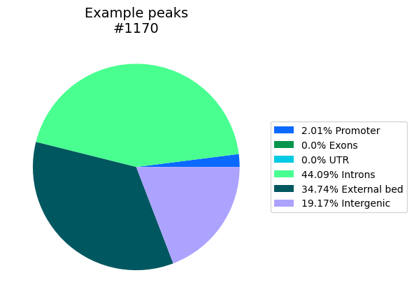
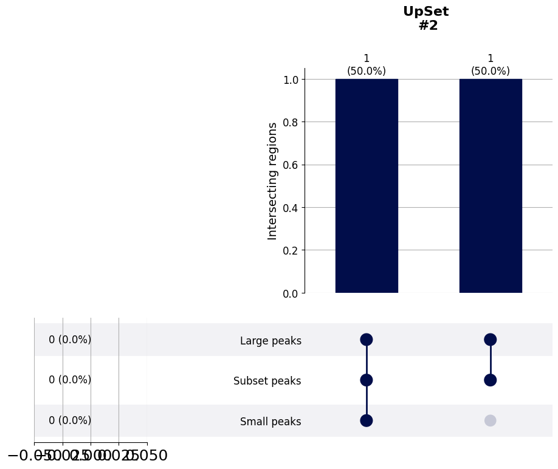

============
Analysis of bed-files
============

Analyses related to bed-files, where the peaks are located with respect to genes, or how multiple bed-files overlap.
Centred on the usage of `pybedtools <https://daler.github.io/pybedtools/>`_, but also works with stored bed-files.
To run the example code for this module, we will always start with this block of code:

.. code-block:: python

    import src.Bed_Analysis as Bed_Analysis
    from pybedtools import BedTool
    out_dir = 'docs/gallery/'  # Replace with wherever you want to store it.
    

.. autofunction:: Bed_Analysis.gene_location_bpwise

.. code-block:: python

    example_bed_file = "ExampleData/H3K27acPeaks_chr21.narrowPeak"
    bed_dict = {'Example peaks': example_bed_file}  # Can have multiple entries, producing output for each.
    annotation = 'ExampleData/gencode.v38.annotation_chr21Genes.gtf'
    # Use a small set of peaks as example.
    region_locs, total_locs = Bed_Analysis.gene_location_bpwise(bed_dict=bed_dict, gtf_file=annotation,
                                                                plot_path=out_dir, tss_type='5', palette='glasbey_cool', formats=['png'])
    # We can add overlap with an additional bed-file as pie piece. In this example we use a few peaks from the original
    # bed-file itself.
    external_bed = 'ExampleData/H3K27acPeaks_chr21_subset.narrowPeak.txt'
    region_locs, total_locs = Bed_Analysis.gene_location_bpwise(bed_dict=bed_dict, gtf_file=annotation, external_bed={"External bed": external_bed},
                                                                plot_path=out_dir+"InclExternal", tss_type='5', palette='glasbey_cool', formats=['png'])
    

|pic1| |pic2|

.. |pic1| image:: gallery/Example_peaks_GeneFeatureLocation_bpwiseOverlap_PieChart.png
   :width: 45%

.. autofunction:: Bed_Analysis.inter_heatmap

.. code-block:: python

    # For the example, let's create three BedTool object. The first one with three large regions, the second repeating
    # two of those regions, and the last having multiple small regions inside one of those.
    large_regions = BedTool('\n'.join(['chr1\t1\t1000', 'chr1\t2000\t3000', 'chr1\t4000\t5000']), from_string=True)
    subset_regions = BedTool('\n'.join(['chr1\t1\t1000', 'chr1\t2000\t3000']), from_string=True)
    small_regions = BedTool('\n'.join(['chr1\t1\t10', 'chr1\t11\t20', 'chr1\t21\t30']), from_string=True)
    multi_bed_dict = {'Large peaks': large_regions,
                      'Subset peaks': subset_regions,
                      'Small peaks': small_regions}
    Bed_Analysis.inter_heatmap(multi_bed_dict, region_label='peaks', plot_path=out_dir, annot_nums=True,  x_size=10, y_size=7,
                               wspace=1, hspace=0.6, width_ratios=[0.05, 0.05, 0.96], height_ratios=[0.05, 0.97], formats=['png'])
    

.. image:: gallery/_MultiIntersectHeat.png
   :width: 90%

.. autofunction:: Bed_Analysis.upset_to_reference

.. code-block:: python

    # Similar to the asymmetric above, this UpSet plot is meant for checking the overlap of bed-files with different sizes.
    # However, this one shows the overlap only with respect to one selected bed-file. Let's use the same example bed objects
    # as for the previous functions, and show the overlap only with respect to the second set of regions. One of the two
    # peaks overlaps with both the large regions and the small regions, and one only with the large regions.
    large_regions = BedTool('\n'.join(['chr1\t1\t1000', 'chr1\t2000\t3000', 'chr1\t4000\t5000']), from_string=True)
    subset_regions = BedTool('\n'.join(['chr1\t1\t1000', 'chr1\t2000\t3000']), from_string=True)
    small_regions = BedTool('\n'.join(['chr1\t1\t10', 'chr1\t11\t20', 'chr1\t21\t30']), from_string=True)
    multi_bed_dict = {'Large peaks': large_regions,
                      'Subset peaks': subset_regions,
                      'Small peaks': small_regions}
    Bed_Analysis.upset_to_reference(bed_files=multi_bed_dict, ref_tag='Subset peaks', y_label='Intersecting regions',
                                    plot_path=out_dir, formats=['png'])
    

