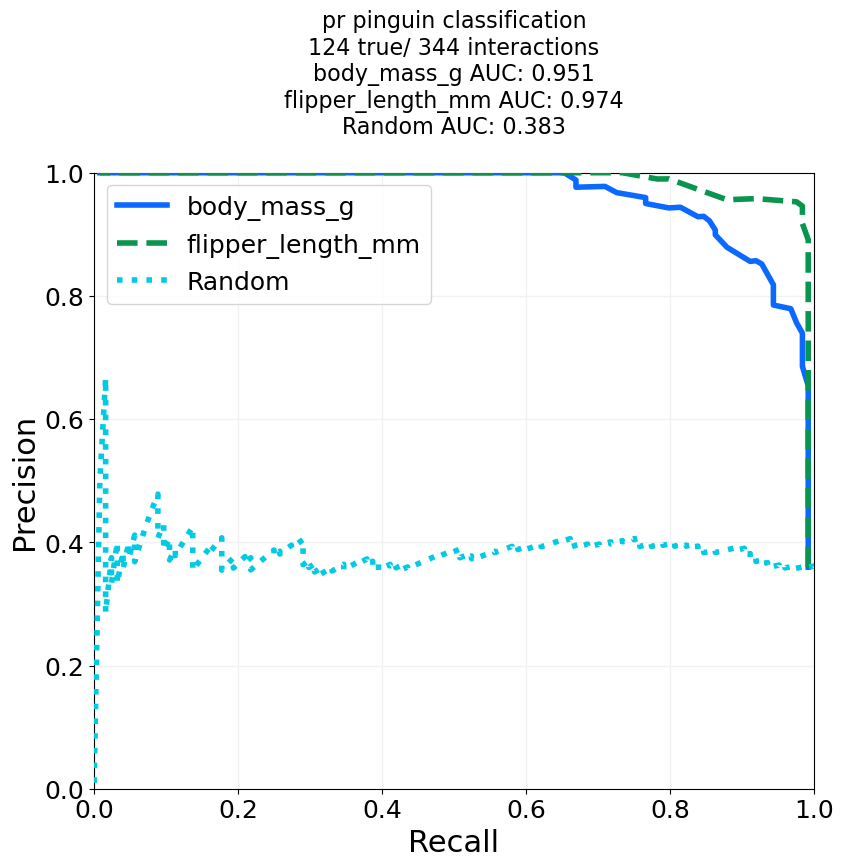

============
Classification Performance Curves
============

Functions to create Precision-Recall and receiver operator characteristic curves and getting the respective area under
the curve.

.. .--------------------------------------------------------------------------------------------------------------------
.. classification_plotter
.. .--------------------------------------------------------------------------------------------------------------------
.. autofunction:: ClassificationPerformanceCurves.classification_plotter

.. code-block:: python

    *ClassificationPerformanceCurves.classification_plotter*

|pic1| |pic2| |pic3|

