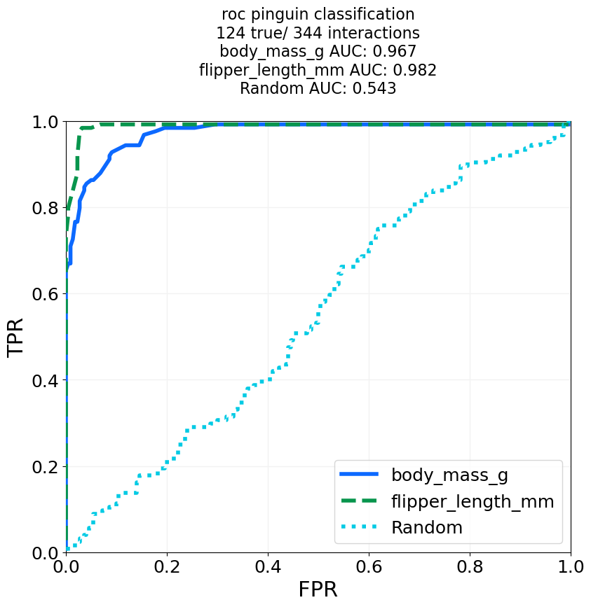
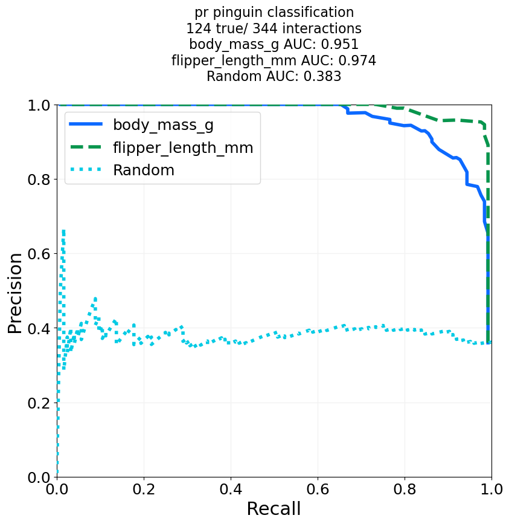
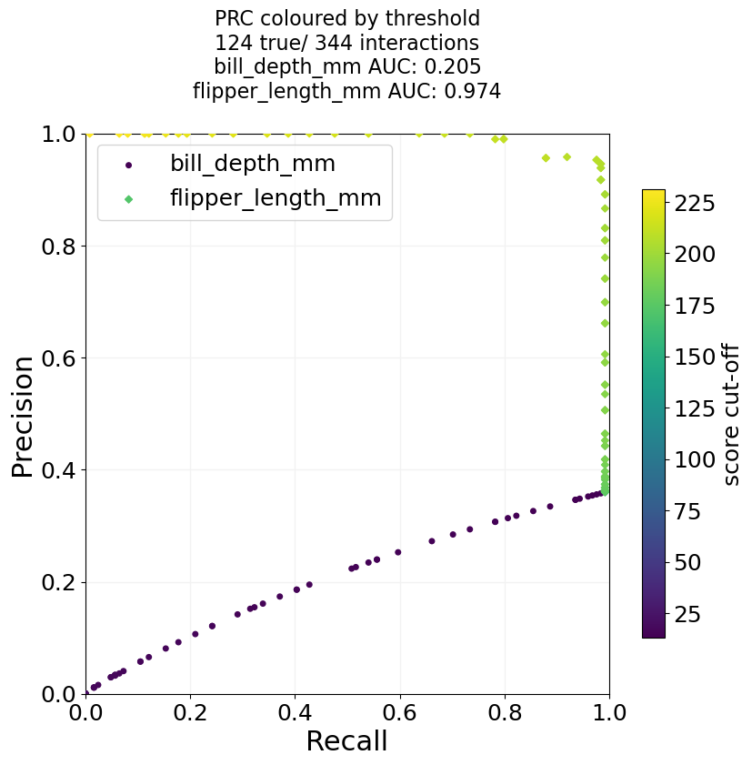

============
Classification Performance Curves
============

Functions to create Precision-Recall and receiver operator characteristic curves and getting the respective area under
the curve.

.. .--------------------------------------------------------------------------------------------------------------------
.. classification_plotter
.. .--------------------------------------------------------------------------------------------------------------------
.. autofunction:: ClassificationPerformanceCurves.classification_plotter

.. code-block:: python

    # For the example, we load the penguin data and try the classification of pinguins into Gentoo and non-Gentoo
    # based on their body mass or flipper length.
    import ClassificationPerformanceCurves
    import seaborn as sns
    out_dir = 'docs/gallery/'
    penguin_df = sns.load_dataset('penguins')   # Example data from seaborn.
    penguin_df['is Gentoo'] = penguin_df['species'] == 'Gentoo'  # We need a boolean to tell true from false entries.
    
    # We try a ROC curve and a Precision-Recall curve, and add curve for random guessing.
    for mode in ['roc', 'pr']:
        auc_output, performance_dict = ClassificationPerformanceCurves.classification_plotter(df=penguin_df, sig_col='is Gentoo', score_cols=['body_mass_g', 'flipper_length_mm'],
                                                               steps=1000, mode=mode, title_tag=mode+' pinguin classification', output_path=out_dir+"GentooClassification", add_random=True,
                                                               colours='glasbey_cool', formats=['png'])
    
    # And we can do a version where we do a scatter plot instead, and colour the dots by the used threshold.
    # In that case, it only makes sense to use columns that have the same metric.
    auc_output, performance_dict = ClassificationPerformanceCurves.classification_plotter(df=penguin_df, sig_col='is Gentoo', score_cols=['bill_depth_mm', 'flipper_length_mm'],
                                                           steps=100, mode='pr', title_tag='PRC coloured by threshold', output_path=out_dir+"GentooClassification",
                                                           colour_by_threshold=True, formats=['png'])
    # As a side-note, the classification based on the bill depth works so bad for Gintoo, because their average bill depth
    # is smaller than that of the other species, and for the function we assume high score means high likelihood to be true.
    

|pic1| |pic2|
|pic3|

