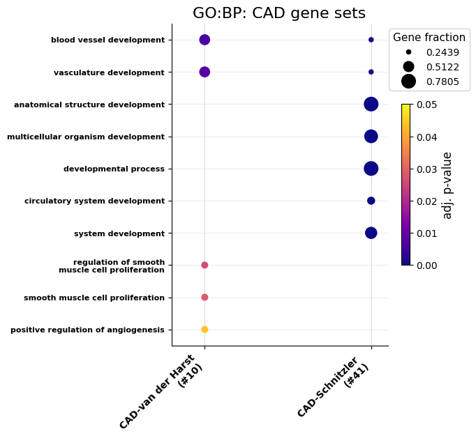

============
GO enrichment
============

A script for running GO term enrichment and producing plots from it.

.. autofunction:: GOEnrichment.go_enrichment

.. code-block:: python

    *GOEnrichment.go_enrichment1*

.. include:: gallery/src.GOEnrichment.go_enrichment1.txt
    :literal:

.. image:: gallery/VanDerHarst_GOBP_maxall.png
   :width: 95%

.. code-block:: python

    *GOEnrichment.go_enrichment2*

.. code-block:: python

    *GOEnrichment.go_enrichment3*

.. image:: gallery/BothSetsFiltered_GOBP_maxall.png
   :width: 90%
