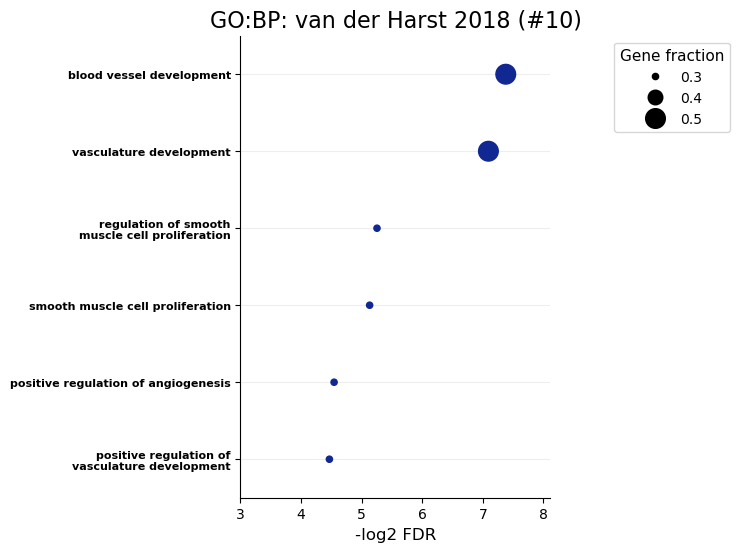

============
GO enrichment
============

A script for running GO term enrichment and producing plots from it.

.. autofunction:: GOEnrichment.go_enrichment

.. code-block:: python

    import GOEnrichment
    out_dir = 'docs/gallery/'  # Replace with wherever you want to store it.
    # We're using a handful of genes from studies finding genes related to Coronary Artery Disease (CAD).
    # 10.1161/CIRCRESAHA.117.312086 and 10.1038/s41586-024-07022-x
    gene_sets = {"CAD-van der Harst": set(open('ExampleData/VanderHarst2018.txt').read().strip().split('\n')),
                 'CAD-Schnitzler ': set(open('ExampleData/Schnitzler2024.txt').read().strip().split('\n'))}
    
    # First let's run only one of them.
    go_dict = GOEnrichment.go_enrichment({"CAD-van der Harst": gene_sets['CAD-van der Harst']}, title_tag='van der Harst 2018',
                                       out_tag=out_dir+'VanDerHarst', max_terms='all', organism='hsapiens',
                                       numerate=True, wanted_sources=['GO:BP'], rotation=45, font_s=16, formats='png')
    print(go_dict['CAD-van der Harst'].head(n=3))  # The print is a bit ugly with so many columsn.
    

.. include:: gallery/src.GOEnrichment.go_enrichment1.txt
    :literal:

.. code-block:: python

    # Next, we can see how both gene sets look like. The second gene set has a huge amount of terms enriched, so we limit
    # it to the top 5 from each gene set.
    go_dict = GOEnrichment.go_enrichment(gene_sets, title_tag='CAD gene sets',
                                       out_tag=out_dir+'BothSets', max_terms=5, organism='hsapiens',
                                       numerate=True, wanted_sources=['GO:BP'], rotation=45, font_s=16, formats='png')
    

.. image:: gallery/BothSets_GOBP_max5.png
   :width: 90%

.. code-block:: python

    # Instead of limiting the terms to the most enriched ones, an alternative is to filter for specific keywords.
    go_dict = GOEnrichment.go_enrichment(gene_sets, title_tag='CAD gene sets', keywords={"GO:BP": ['angio', 'vasc', 'circ', 'muscle']},
                                       out_tag=out_dir+'BothSetsFiltered', max_terms='all', organism='hsapiens',
                                       numerate=True, wanted_sources=['GO:BP'], rotation=45, font_s=16, formats='png')
    

