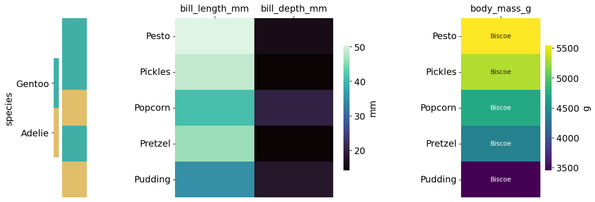

============
Heatmaps
============

Functions for plotting heat- and clustermaps with seaborn. They are rather specific, and there might be better options in R or with
PyComplexHeatmap.

.. code-block:: python

    *Heatmaps.base_code*

.. .--------------------------------------------------------------------------------------------------------------------
.. heatmaps
.. .--------------------------------------------------------------------------------------------------------------------
.. autofunction:: Heatmaps.heatmap_cols

.. code-block:: python

    *Heatmaps.heatmap_cols*

.. .--------------------------------------------------------------------------------------------------------------------
.. clustermaps
.. .--------------------------------------------------------------------------------------------------------------------
.. autofunction:: Heatmaps.clustermap

.. code-block:: python

    *Heatmaps.clustermap*

|clustermap1| |clustermap2|

.. |clustermap1| image:: gallery/Penguins_NoneZScore_Clustermap.png
   :width: 49%

.. |clustermap2| image:: gallery/Penguins_0ZScore_Clustermap.png
   :width: 49%

