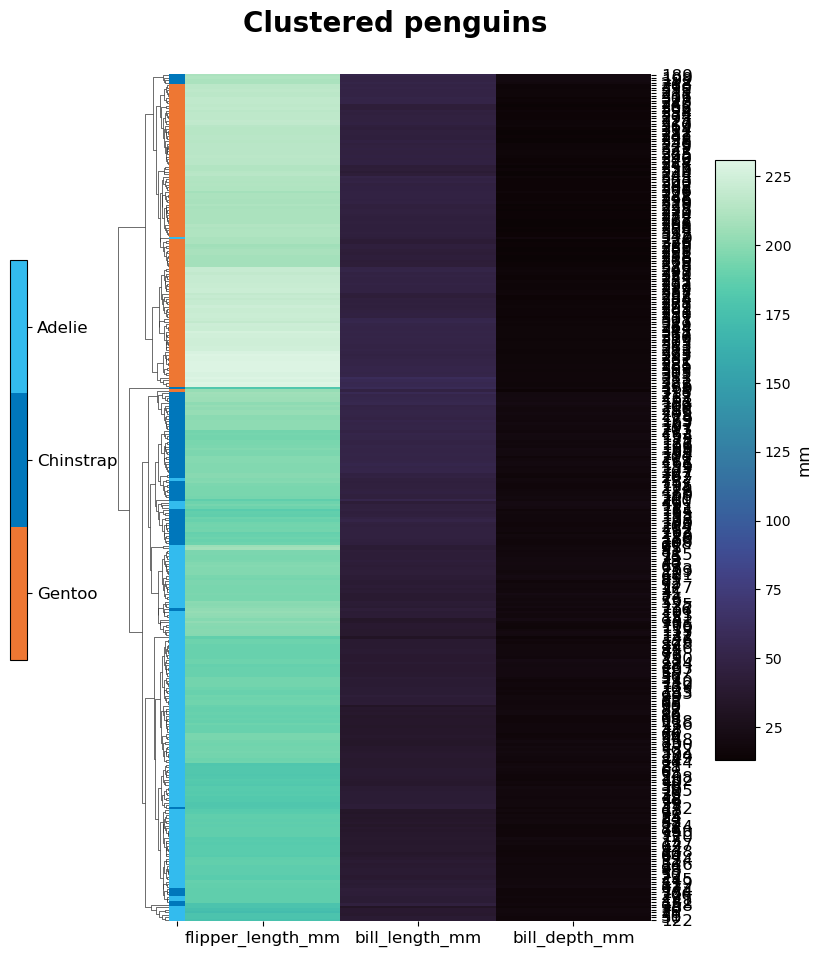

============
Heatmaps
============

Functions for plotting heat- and clustermaps with seaborn. They are rather specific, and there might be better options in R or with
PyComplexHeatmap.

.. code-block:: python

    # Block that has to be executed for all.
    import Heatmaps
    import seaborn as sns
    import numpy as np
    out_dir = 'docs/gallery/'
    penguin_df = sns.load_dataset('penguins')   # Example data from seaborn.
    

.. .--------------------------------------------------------------------------------------------------------------------
.. heatmaps
.. .--------------------------------------------------------------------------------------------------------------------
.. autofunction:: Heatmaps.heatmap_cols

.. code-block:: python

    # Create a heatmap with several blocks that allow separate metrics to be shown side-by-side.
    # For an example pick a few random rows and give them names so we can recognize them in the heatmaps.
    sub_penguin_df = penguin_df.sample(5, random_state=12)
    sub_penguin_df['Name'] = ['Pesto', 'Pickles', 'Popcorn', 'Pretzel', 'Pudding']
    # Now we need to define which heatmap-blocks we want to show.
    cmap_cols = {0: {'cols': ['bill_length_mm', 'bill_depth_mm'],
                     'cmap': 'mako',
                     'cbar_label': 'mm'},
                 1: {'cols': ["body_mass_g"],
                     'cmap': 'viridis',  # Just for the sake of a different colour.
                     'cbar_label': 'g'}
                 }
    # We can additionally choose to add labels into cells, can be any other column.
    annot_cols = {"body_mass_g": 'island'}
    Heatmaps.heatmap_cols(sub_penguin_df, cmap_cols=cmap_cols, plot_out=out_dir+"SubPenguins", row_label_col='Name', class_col='species',
                     x_size=14, y_size=5, annot_cols=annot_cols, width_ratios=None, wspace=0.8,
                     annot_s=10, ticksize=14, heat_ticksize=14, square=False, x_rotation=0, formats=['png'])
    

.. image:: gallery/SubPenguins_MultiColHeatmap.png
  :width: 100%

.. .--------------------------------------------------------------------------------------------------------------------
.. clustermaps
.. .--------------------------------------------------------------------------------------------------------------------
.. autofunction:: Heatmaps.clustermap

.. code-block:: python

    # Let's cluster some penguins based on their measured features, after removing entries with NAs.
    non_na_penguins = penguin_df[~penguin_df.isna().values.any(axis=1)]
    # Once with the original values and once with z-scoring the columns (flag takes None or the axis).
    # The row names will be the index numbers, which are not meaningful here, but suffices for illustration.
    for do_z in [None, 0]:
        cmap = 'mako' if do_z is None else 'bwr'
        centre = None if do_z is None else 0
        Heatmaps.clustermap(non_na_penguins, columns=['bill_length_mm', 'bill_depth_mm', 'flipper_length_mm'],
                            row_column='index', z_score=do_z, centre=centre, cbar_label='mm', class_col='species',
                            title="Clustered penguins", plot_out=out_dir+"Penguins_"+str(do_z)+'ZScore', cmap=cmap,
                            x_size=8, y_size=10, row_cluster=True, col_cluster=True, formats=['png'])
    

|clustermap1| |clustermap2|

