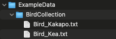

============
Various
============

A collection of functions that don't really fit with anything else.

.. autofunction:: Various.fn_patternmatch

.. code-block:: python

    import src.Various as Various
    my_files = Various.fn_patternmatch('ExampleData/BirdCollection/Bird_*.txt')
    print(my_files)
    

.. include:: gallery/src.Various.fn_patternmatch.txt
    :literal:

